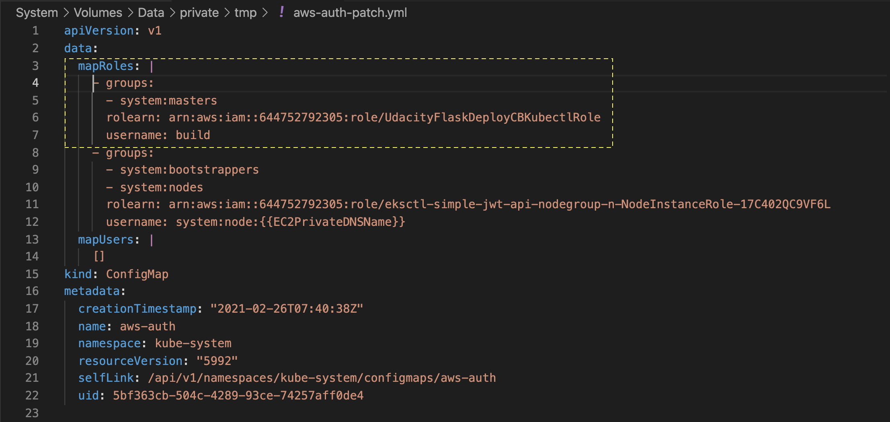
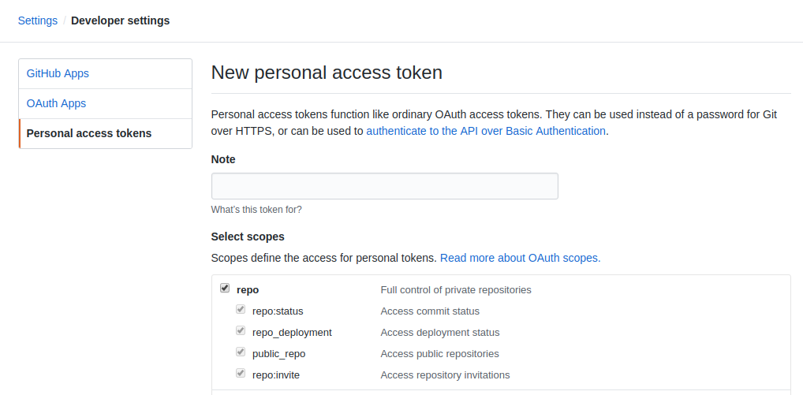
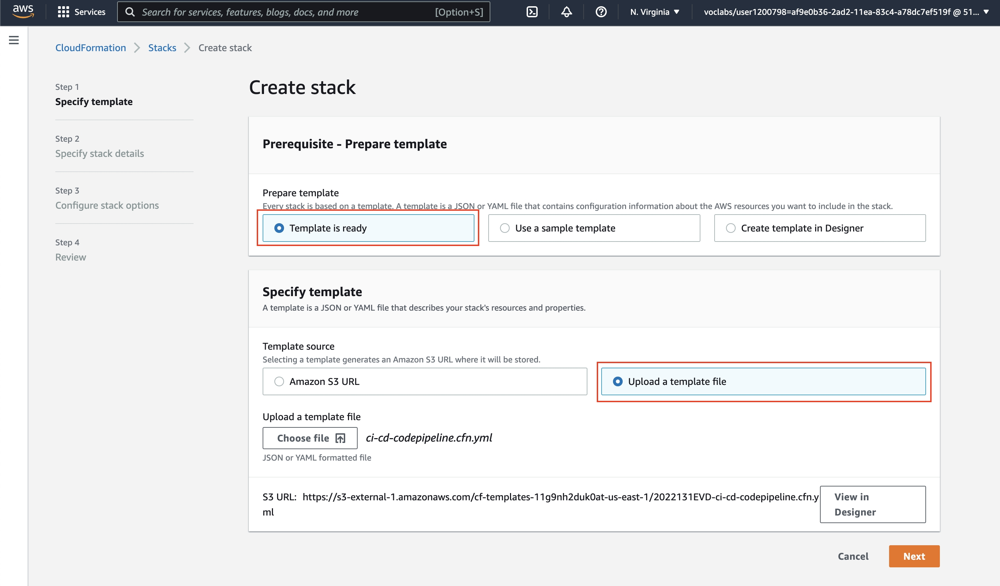

# Purpose of This Repo

This repos has a sample "Hello World" flask application that we will deploy on EKS cluster using the AWS Codebuild and Codepipeline services. 
Here is the purpose of each file present in this repo:
```bash

├── app.py         # A sample "Hello World" flask application
├── ci-cd-codepipeline.cfn.yml # Cloudformation template to create the Codebuild, and Codepipeline, and related resources. 
├── buildspec.yml  # Codebuild will execute the commands available here. 
├── Dockerfile     # Codebuild will build an image using the Dockerfile, and push it to the Dockerhub/or AWS ECR. 
├── deployment.yml # The deployment file for the Kubernetes cluster. Codebuild will apply this deployment using the one of the kubectl commands.   
├── iam-role-policy.json # The Policy for the IAM role that the Codebuild will assume
├── trust.json # The trusted entity details for the  IAM role that the COdebuild will assume
└── aws-auth-patch.yml  # This is an autogenerated file for your reference. 
```


## Run the app on AWS Cloud
The steps you will follow are:
1. **Create an EKS Cluster, IAM Role for CodeBuild, and Authenticate the CodeBuild**<br>
You will start with creating an EKS cluster in your preferred region, using `eksctl` command. Then, you will create an IAM role that the Codebuild will assume to access your k8s/EKS cluster. This IAM role will have the necessary access permissions (attached JSON policies), and you will also have to add this role to the k8s cluster's configMap. <br><br>


2. **Deployment to Kubernetes using CodePipeline and CodeBuild**
 - **Generate a Github access token**<br>Next, you will generate an access-token from your Github account so that whichever service has that token can access the repositories from your Github account. You will share this token with the AWS Codebuild service (programmatically) so that it can build and test your code. <br><br>
 
 - **Create Codebuild and CodePipeline resources using CloudFormation template**<br>Create a pipeline watching for commits to your Github repository. You will create the necessary AWS resources using a script, Cloudformation template (.yaml) file, available to you. These resources collectively are called **stack**. It will automatically create the Codebuild and Codepipeline projects for you. <br><br>
 
 
 - **Build and deploy**<br>Finally, you will trigger the **build** based on a Github commit. 


# Pipeline
## Create an IAM Role for Code Build

### 1. Create an EKS Cluster

Create Kubernetes cluster, eksctl-demo using the command below:

`eksctl create cluster --name eksctl-demo --nodes=2 --version=1.22 --instance-types=t2.medium --region=us-east-2`

The `eksctl` command will automatically configure the local kubeconfig file so that you can communicate with the newly created cluster as:

```bash
## Check the status, Nodes should be ready
kubectl get nodes
```
### 2. Create an IAM Role for CodeBuild
Can the CodedBuild service access and see the details of your existing EKS cluster? **The answer is NO!**

Therefore, having your CodeBuild service communicate with the EKS cluster will require:

- **Authenticate the CodeBuild:** Create an IAM role that the CodeBuild will assume. This IAM role will have two components:
    + **Trust relationship**: You (the root user) will "trust" the CodeBuild service, which will assume this IAM role.
    + **Policies**: You will mention the set of permissible actions that the Codebuild can perform, such as viewing the details of the EKS cluster.
- **Authorize the CodeBuild:** After creating the IAM role, the authorization step is done at the EKS end. EKS has an RBAC system that allows new roles access to the cluster. The RBAC details are present in a ConfigMap (YAML file) where you will add the details of the new IAM role.

Let's create an IAM role for authenticating the Codebuild. Creating an IAM role has two components:

#### 2.1. Create a Trust relationship
We can define the [Trust relationship](https://docs.aws.amazon.com/IAM/latest/UserGuide/id_roles_create_for-user.html) in the form of a JSON file. However, we have given this file, [trust.json](https://github.com/nguyentrongphuc/aws_pipeline/blob/master/trust.json), for your convenience. At this point, it is essential to understand two terms:

- Trusting account: the resource owner (EKS cluster). In our example, it is YOU because you've created the EKS cluster. We will mention the details of the Trusting account in the trust.json.
- Trusted account: the entity/service who will assume the role to need access to the resource (EKS cluster). In our example, it is the CodeBuild service.

Here are the steps to create a Trust relationship:

1. Find your AWS account ID using the command:
```bash
aws sts get-caller-identity --query Account --output text`

## Returns the AWS account id similar to 
## 519002666132
```

1. Update the trust.json file with your AWS account id.
```json
{
"Version": "2012-10-17",
"Statement": [
    {
        "Effect": "Allow",
        "Principal": {
            "AWS": "arn:aws:iam::<ACCOUNT_ID>:root"
        },
        "Action": "sts:AssumeRole"
    }
]
}
```

Replace the <ACCOUNT_ID> with your actual AWS account ID. Reference: Creating a role to delegate permissions to an IAM user

#### 2.2. Create the Policy
Policy is also a JSON file where we will define the set of permissible actions that the Codebuild can perform. A policy can have multiple actions, though we need just one for this example: `eks:Describe`
We have given you a policy file, [iam-role-policy.json](https://github.com/nguyentrongphuc/aws_pipeline/blob/master/iam-role-policy.json), containing the following permissible action:

{
 "Version": "2012-10-17",
 "Statement": [
     {
         "Effect": "Allow",
         "Action": [
             "eks:Describe*"
         ],
         "Resource": "*"
     }
 ]
}

#### 2.3. Create an IAM role
Run this command to create a role, using the trust relationship defined in trust.json:
```bash
aws iam create-role --role-name UdacityFlaskDeployCBKubectlRole --assume-role-policy-document file://trust.json --output text --query 'Role.Arn'
```

In the command above:

- `--role-name` allows you to give the role a name of your choice
- `--assume-role-policy-document` option used to provide the path of the trust relationship file
- `--output` option defines the output format
- `--query` option decides what information to query and display on the terminal. Specifiying 'Role.Arn' means we want to view the ARN of the new role. The ARN stands for Amazon Resource Name, which uniquely identifies AWS resources.

Reference: [aws iam create-role](https://docs.aws.amazon.com/cli/latest/reference/iam/create-role.html)

Next, attach the Policy to the IAM role using the command:
```bash
aws iam put-role-policy --role-name UdacityFlaskDeployCBKubectlRole --policy-name eks-describe --policy-document file://iam-role-policy.json
```

In the command above:

- `--role-name` takes the name of the role to associate the new policy with
- `--policy-name` option accepts the name of the policy document
- `--policy-document` option is used to provide the path of the policy file

Reference: [put-role-policy](https://docs.aws.amazon.com/cli/latest/reference/iam/put-role-policy.html)

## Authorize Code Build using EKS RBAC

IAM role is only used for authentication of valid IAM entities. All authorization permissions for interacting with your Amazon EKS cluster’s Kubernetes API are managed through the native Kubernetes RBAC (Role Based Access Control) system.

Kubernetes RBAC system allows the new role access to the cluster. EKS maintains a file, [ConfigMap](https://docs.aws.amazon.com/eks/latest/userguide/add-user-role.html#aws-auth-configmap), which is used to grant the role-based access to the underlying cluster. In addition to assigning the new role to the CodeBuild service, you will have to add this new role to the ConfigMap.

Only you have the sole permission to administer the cluster when you create a new cluster. No other user/AWS service will be able to perform any action. Later, if you want the CodeBuild service to interact with your cluster, you will have to make an entry into the ConfigMap. Ensure that the IAM role assumed by the CodeBuild must have the necessary permissions.

Let's see the steps below:

### 1. Fetch
First, get the current ConfigMap and save it to a file:
```bash
# Mac/Linux - The file will be created at `/System/Volumes/Data/private/tmp/aws-auth-patch.yml` path
kubectl get -n kube-system configmap/aws-auth -o yaml > /tmp/aws-auth-patch.yml

# Mac - I want to save aws-auth-patch.yml in <current_directory>/images/aws-auth-patch.yml
kubectl get -n kube-system configmap/aws-auth -o yaml > ./images/aws-auth-patch.yml

# Windows users can create the aws-auth-patch.yml file in the current working directory
kubectl get -n kube-system configmap/aws-auth -o yaml > aws-auth-patch.yml
```

### 2. Edit
Open the `aws-auth-patch.yml` file using any editor, such as VS code editor:
```bash
# Mac/Linux
code /System/Volumes/Data/private/tmp/aws-auth-patch.yml
# Windows
code aws-auth-patch.yml
```

and add the following group in the **data → mapRoles** section of this file:
```yml
 - groups:
   	- system:masters
   	rolearn: arn:aws:iam::<ACCOUNT_ID>:role/UdacityFlaskDeployCBKubectlRole
   	username: build     
``` 

Don't forget to replace the <ACCOUNT_ID> with your AWS account Id. Do not copy-paste the code snippet from above. Instead, look at this [sample aws-auth-patch.yml](https://github.com/nguyentrongphuc/aws_pipeline/blob/master/aws-auth-patch.yml) file and the snapshot below to stay careful with the indentations.


File **aws-auth-patch.yml** in the editor. Notice the indentation of the highlighted part.

### 3. Update
Update your cluster's configmap:
```bash
# Mac/Linux
kubectl patch configmap/aws-auth -n kube-system --patch "$(cat /tmp/aws-auth-patch.yml)"

# Mac - patch file from <Current_Directory>/images/aws-auth-patch.yml
kubectl patch configmap/aws-auth -n kube-system --patch "$(cat ./images/aws-auth-patch.yml)"

# Windows
kubectl patch configmap/aws-auth -n kube-system --patch "$(cat aws-auth-patch.yml)"
```

The command above must show you `configmap/aws-auth` patched as response.

### 4. Troubleshoot

In case of the following error, re-run the above three steps beginning from the `kubectl get` command.

Error from server (Conflict): Operation cannot be fulfilled on configmaps "aws-auth": the object has been modified; please apply your changes to the latest version and try again

## Deploy to EKS cluster

Deployment to Kubernetes using CodePipeline and CodeBuild

You will now create a pipeline that watches your Github and deploys your application using CodePipeline and CodeBuild. When changes are pushed to the repo, it will build a new image and deploy it to your EKS cluster. Follow the steps below to complete your project.

### 1. Generate a Github access token
A Github access token will allow CodePipeline to monitor when a repo is changed. A token is analogous to your Github password and can be generated [here](https://github.com/settings/tokens/). You should generate the token with full control of private repositories, as shown in the image below. Be sure to save the token somewhere that is secure.


Generate GitHub Access Token with full control of private repositories

### 2. Create Codebuild and CodePipeline resources using CloudFormation template
#### 2.1. Modify the template

There is a file named [ci-cd-codepipeline.cfn.yml](https://github.com/nguyentrongphuc/aws_pipeline/blob/master/ci-cd-codepipeline.cfn.yml) provided in your starter repo. This is the template file that will create your CodePipeline and CodeBuild resources Open this file, and go to the 'Parameters' section. Ensure that the following values are used for the parameter variables:

```yml
  EksClusterName:
    Default: eksctl-demo

  GitSourceRepo:
    Default: aws_pipeline
    
  GitBranch:
    Default: master
    
  GitHubToken:
    ConstraintDescription: You must enter a GitHub personal access token
    
  GitHubUser:
    
  CodeBuildDockerImage:
    Default: aws/codebuild/standard:4.0
    
  KubectlRoleName:
    Default: UdacityFlaskDeployCBKubectlRole
```

#### 2.2. Review the resources
Review the resources that will be created using this ci-cd-codepipeline.cfn.yml file. The Cloudformation template file ci-cd-codepipeline.cfn.yml will create the following resources:

- ECR repository to store your Docker image.
- S3 bucket to store your Pipeline artifacts
- A custom provisioning logic
- A Lambda function and its IAM role
- CodeBuild and CodePipeline resources and their IAM roles

#### 2.3. Create Stack
Use the AWS web-console to create a stack for CodePipeline using the CloudFormation template file ci-cd-codepipeline.cfn.yml. Go to the CloudFormation service in the AWS console. Press the Create Stack button. It will make you go through the following three steps -

##### 1. Specify template - Choose the options "Template is ready" and "Upload a template file" to upload the template file ci-cd-codepipeline.cfn.yml. Click the 'Next' button. 


##### 2. Specify stack details - Give the stack a name. You will have a few fileds auto-populated from the parameters used in the ci-cd-codepipeline.cfn.yml file. Fill in your GitHub access token generated in the previous step. Ensure that the Github repo name, IAM role, and EKS cluster name matches with the ones you created earlier.


### 3. How does CodeBuild know the build steps?
After the successful creation of the stack, you can see the CodeBuild and CodePipeline resources get created for you. **When the build will trigger, Codebuild will execute the commands/steps mentioned in the buildspec.yml file.**

`A buildspec.yml contains a collection of build commands that CodeBuild uses to run a build.`

The CodeBuild expects the build specification in the buildspec.yml. This file must be placed in the root of your source directory (Github repo).


#### 3.1. Configuring buildspec.yml

In the buildspec.yml file, use the same (or within one minor version difference) KUBECTL version as you've used while creating an EKS cluster. You can run `kubectl version --short --client` in your local terminal to check the version locally. Change the version in the buildspec.yml file with a specific version of your choice. Refer to the [AWS docs](https://docs.aws.amazon.com/eks/latest/userguide/install-kubectl.html) or [k8s](https://kubernetes.io/docs/tasks/tools/install-kubectl-linux/) docs to see the available versions for Linux machines (our Codebuild will use Linux containers internally to run build commands!).

**Note** - You must use a kubectl version within one minor version difference of your Amazon EKS cluster control plane. For example, a 1.22 kubectl client works with Kubernetes 1.21, 1.22, and 1.23 clusters.


#### 3.2. Details of the buildspec.yml
The *buildspec.yml* file specifies the different phases of a build, such as an install, pre-build, build, and post-build. Each phase has a set of commands to be automatically executed by CodeBuild.

- *install* phase: Install Python, pip, kubectl, and update the system path
- *pre-build* phase: Log into the ECR repo where the Codebuils will push the Docker image.
- *build* phase: Build a Docker image
- *post-build* phase: Push the Docker image to the ECR repo, update the EKS cluster's kubeconfig, and apply the configuration defined in the simple_jwt_api.yml to the cluster.
You can see each command being executed in the CodeBuild log console when you trigger a build.

### 4. Troubleshoot
